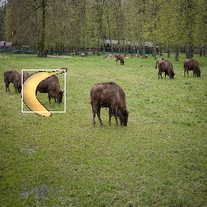
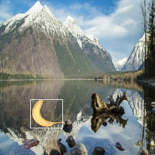
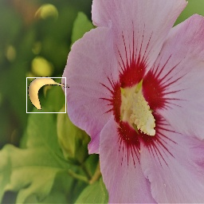

# 自己打造一个深度学习框架 for java

###  前言
从16年开始利用空余时间研究深度学习的方面，由于工作的原因，最熟悉的编程语言就是java，所以框架的编程语言自然而然就使用了java。自己打造框架的初衷就是为了更加深入了解各个算法、模型、实现的原理和思路。
## 框架介绍
Omega-AI：基于java打造的深度学习框架，帮助你快速搭建神经网络，实现训练或测试模型，支持多线程运算，框架目前支持BP神经网络、卷积神经网络、vgg16、resnet、yolo等模型的构建，目前引擎最新版本支持CUDA和CUDNN两种GPU加速方式，关于GPU加速的环境配置与jcuda版本jar包的对应依赖，欢迎添加QQ群([119593195]())进行技术讨论和交流，别忘了给Omega-AI项目点个star，项目需要你们的支持。
### 源码地址：

[https://gitee.com/iangellove/omega-ai](https://gitee.com/iangellove/omega-ai)

[https://github.com/iangellove/Omega-AI](https://github.com/iangellove/Omega-AI)

### 依赖
由于omega-engine-1.0.3加入了jcuda支持，所以1.0.3需要安装与jcuda版本对应的cuda，我在该项目中使用的是jcuda-11.2.0版本的包，那么我cuda需要安装11.2.x版本

### 系统参数
由于训练vgg16模型的参数比较庞大，所以在部署项目的时候需要对jvm内存进行调整.
调整事例如：-Xmx20480m -Xms20480m -Xmn10240m

### Demo展示
[基于卷积神经网络mnist手写数字识别](http://120.237.148.121:8011/mnist)


[基于yolo算法目标识别](#yolo-banana-detection-demo)



[基于yolov3口罩佩戴识别](#yolov3-mask-demo口罩佩戴识别)


[基于yolov3安全帽佩戴识别](#yolov3-helmet-demo安全帽佩戴识别)


##  功能介绍
#### 支持的网络层类型：

Fullylayer 全连接层

ConvolutionLayer 卷积层

PoolingLayer 池化层(maxpooling,meanpooling)

AVGPooingLayer 全局平均池化层

#### 激活函数层

SoftmaxLayer (softmax激活函)

ReluLayer

LeakyReluLayer

TanhLayer

SigmodLayer

#### 归一化层

BNLayer (Batch Normalization)

DropoutLayer

#### 优化器

Momentum

Adam

Adamw

Sgd (sgd with momentum)

#### 训练器

BGDOptimizer (批量梯度下降法)

MBSGDOptimizer (小批量随机梯度下降)

SGDOptimizer（随机梯度下降算法）

#### 损失函数(loss function)

MSELoss (平方差损失函数)

CrossEntropyLoss (交叉熵损失函数)

CrossEntropyLossWithSoftmax (交叉熵损失 + softmax)

MultiLabelSoftMargin (多标签损失函数)

#### 学习率更新器（LearnRateUpdate）

NONE (固定学习率)

LR_DECAY (decay)

GD_GECAY (gd_decay)

CONSTANT(gd_decay)

RANDOM [Math.pow(RandomUtils.getInstance().nextFloat(), power) * this.lr]

POLY [this.lr * Math.pow((1.0f - (batchIndex * 1.0f / trainTime / dataSize * batchSize)), power)]

STEP [this.lr * Math.pow(this.scale, batchIndex / step)]

EXP [this.lr * Math.pow(this.gama, batchIndex)]

SIG [this.lr / (1 + Math.pow(Math.E, this.gama * (batchIndex - step)))]

#### 数据加载器

.bin (二进制数据文件)

.idx3-ubyte

.txt

## 使用说明

### 自带的数据集

iris（鸢尾花数据集）

mnist（手写数字数据集）

cifar_10 （cifar_10数据集）

### 附加数据集
[banana-detection](https://pan.baidu.com/s/1mUr12FJm9OGbsObqfjZ81Q?pwd=jish)

[vailCode](https://pan.baidu.com/s/11wZY9gQQ9OuoViw11IW6BQ?pwd=2rdt)

[helmet](https://pan.baidu.com/s/1pbTaDHoRzhV-kuWoXOCPqw?pwd=y8ij)

[mask](https://pan.baidu.com/s/1D3zTYTiNYmtU6x7Ui9ej_A?pwd=r4o3)

### 数据集成绩

iris epoch:5 bp神经网络[3层全连接层]  测试数据集准确率100%

mnist epoch:10 alexnet 测试数据集准确率98.6% 

cifar_10 epoch:50 alexnet 测试数据集准确率76.6%

cifar_10 epoch:50 vgg16 测试数据集准确率86.45%

cifar_10 epoch:300 resnet18 [batchSize:128,初始learningRate:0.1,learnRateUpdate:GD_GECAY,optimizer:adamw] 数据预处理[randomCrop,randomHorizontalFilp,cutout,normalize] 测试数据集准确率91.23% 

## 事例代码

#### bp iris demo

```java
public void bpNetwork_iris() {
		// TODO Auto-generated method stub

		/**
		 * 读取训练数据集
		 */
		String iris_train = "/dataset/iris/iris.txt";
		
		String iris_test = "/dataset/iris/iris_test.txt";
		
		String[] labelSet = new String[] {"1","-1"};
		
		DataSet trainData = DataLoader.loalDataByTxt(iris_train, ",", 1, 1, 4, 2,labelSet);
		DataSet testData = DataLoader.loalDataByTxt(iris_test, ",", 1, 1, 4, 2,labelSet);
		
		System.out.println("train_data:"+JsonUtils.toJson(trainData));
	
		BPNetwork netWork = new BPNetwork(new SoftmaxWithCrossEntropyLoss());
		
		InputLayer inputLayer = new InputLayer(1,1,4);
		
		FullyLayer hidden1 = new FullyLayer(4, 40);
		
		ReluLayer active1 = new ReluLayer();
		
		FullyLayer hidden2 = new FullyLayer(40, 20);
		
		ReluLayer active2 = new ReluLayer();
		
		FullyLayer hidden3 = new FullyLayer(20, 2);

		SoftmaxWithCrossEntropyLayer hidden4 = new SoftmaxWithCrossEntropyLayer(2);
		
		netWork.addLayer(inputLayer);
		netWork.addLayer(hidden1);
		netWork.addLayer(active1);
		netWork.addLayer(hidden2);
		netWork.addLayer(active2);
		netWork.addLayer(hidden3);
		netWork.addLayer(hidden4);

		try {
			
			MBSGDOptimizer optimizer = new MBSGDOptimizer(netWork, 8, 0.00001d, 10, LearnRateUpdate.NONE);
		
			optimizer.train(trainData);
			
			optimizer.test(testData);
			
		} catch (Exception e) {
			// TODO Auto-generated catch block
			e.printStackTrace();
		}

	}
````

#### cnn mnist demo

```java
public void cnnNetwork_mnist() {
		// TODO Auto-generated method stub
		
		try {

			/**
			 * 读取训练数据集
			 */
			String mnist_train_data = "/dataset/mnist/train-images.idx3-ubyte";
			
			String mnist_train_label = "/dataset/mnist/train-labels.idx1-ubyte";
			
			String mnist_test_data = "/dataset/mnist/t10k-images.idx3-ubyte";
			
			String mnist_test_label = "/dataset/mnist/t10k-labels.idx1-ubyte";
			
			String[] labelSet = new String[] {"0","1","2","3","4","5","6","7","8","9"};
			
			Resource trainDataRes = new ClassPathResource(mnist_train_data);

			Resource trainLabelRes = new ClassPathResource(mnist_train_label);
			
			Resource testDataRes = new ClassPathResource(mnist_test_data);
			
			Resource testLabelRes = new ClassPathResource(mnist_test_label);
			
			DataSet trainData = DataLoader.loadDataByUByte(trainDataRes.getFile(), trainLabelRes.getFile(), labelSet, 1, 1 , 784, true);
			
			DataSet testData = DataLoader.loadDataByUByte(testDataRes.getFile(), testLabelRes.getFile(), labelSet, 1, 1 , 784, true);

			int channel = 1;
			
			int height = 28;
			
			int width = 28;
			
			CNN netWork = new CNN(new SoftmaxWithCrossEntropyLoss(), UpdaterType.momentum);
			
			netWork.learnRate = 0.001d;
			
			InputLayer inputLayer = new InputLayer(channel, 1, 784);
			
			ConvolutionLayer conv1 = new ConvolutionLayer(channel, 6, width, height, 5, 5, 2, 1, false);
			
			BNLayer bn1 = new BNLayer();
			
			LeakyReluLayer active1 = new LeakyReluLayer();
			
			PoolingLayer pool1 = new PoolingLayer(conv1.oChannel, conv1.oWidth, conv1.oHeight, 2, 2, 2, PoolingType.MAX_POOLING);
			
			ConvolutionLayer conv2 = new ConvolutionLayer(pool1.oChannel, 12, pool1.oWidth, pool1.oHeight, 5, 5, 0, 1, false);
			
			BNLayer bn2 = new BNLayer();
			
			LeakyReluLayer active2 = new LeakyReluLayer();
			
			DropoutLayer drop1 = new DropoutLayer(0.5d);
			
			
			PoolingLayer pool2 = new PoolingLayer(conv2.oChannel, conv2.oWidth, conv2.oHeight, 2, 2, 2, PoolingType.MAX_POOLING);

			int fInputCount = pool2.oChannel * pool2.oWidth * pool2.oHeight;
			
			int inputCount = (int) (Math.sqrt((fInputCount) + 10) + 10);
			
			FullyLayer full1 = new FullyLayer(fInputCount, inputCount, false);

			BNLayer bn3 = new BNLayer();
			
			LeakyReluLayer active3 = new LeakyReluLayer();
			
			FullyLayer full2 = new FullyLayer(inputCount, 10);
			
			SoftmaxWithCrossEntropyLayer softmax = new SoftmaxWithCrossEntropyLayer(10);

			netWork.addLayer(inputLayer);
			netWork.addLayer(conv1);
			netWork.addLayer(bn1);
			netWork.addLayer(active1);
			netWork.addLayer(pool1);
			netWork.addLayer(conv2);
			netWork.addLayer(bn2);
			netWork.addLayer(active2);
			netWork.addLayer(drop1);
			netWork.addLayer(pool2);
			netWork.addLayer(full1);
			netWork.addLayer(bn3);
			netWork.addLayer(active3);
			netWork.addLayer(full2);
			netWork.addLayer(softmax);

			MBSGDOptimizer optimizer = new MBSGDOptimizer(netWork, 10, 0.0001d, 96, LearnRateUpdate.NONE);

			long start = System.currentTimeMillis();
			
			optimizer.train(trainData);
			
			optimizer.test(testData);
			
			System.out.println(((System.currentTimeMillis() - start) / 1000) + "s.");

			
		} catch (Exception e) {
			// TODO: handle exception
			e.printStackTrace();
		}
		
	}
````
#### resnet cifar10 demo

```java
	public void resnet18_cifar10() {
		// TODO Auto-generated method stub

		try {

			String[] labelSet = new String[] {"airplane","automobile","bird","cat","deer","dog","frog","horse","ship","truck"};
	    	
			String[] train_data_filenames = new String[] {
					"H:/dataset/cifar-10/data_batch_1.bin",
					"H:/dataset/cifar-10/data_batch_2.bin",
					"H:/dataset/cifar-10/data_batch_3.bin",
					"H:/dataset/cifar-10/data_batch_4.bin",
					"H:/dataset/cifar-10/data_batch_5.bin"
			};
			
			String test_data_filename = "H:/dataset/cifar-10/test_batch.bin";
			
			float[] mean = new float[] {0.491f, 0.482f, 0.446f};
			float[] std = new float[] {0.247f, 0.243f, 0.261f};
			
			DataSet trainData = DataLoader.getImagesToDataSetByBin(train_data_filenames, 10000, 3, 32, 32, 10, labelSet, true);

			DataSet testData = DataLoader.getImagesToDataSetByBin(test_data_filename, 10000, 3, 32, 32, 10, labelSet, true, mean, std);
			
			System.out.println("data is ready.");

			int channel = 3;
			
			int height = 32;
			
			int width = 32;
			
			CNN netWork = new CNN(LossType.softmax_with_cross_entropy, UpdaterType.adamw);
			
			netWork.CUDNN = true;
			
			netWork.learnRate = 0.1f;
			
			InputLayer inputLayer = new InputLayer(channel, height, width);
			
			ConvolutionLayer conv1 = new ConvolutionLayer(channel, 64, width, height, 3, 3, 1, 1, false);
			
			BNLayer bn1 = new BNLayer();
			
			ReluLayer active1 = new ReluLayer();
			
			/**
			 * block1  64 * 32 * 32
			 */
			BasicBlockLayer bl1 = new BasicBlockLayer(conv1.oChannel, 64, conv1.oHeight, conv1.oWidth, 1, netWork);
			ReluLayer active2 = new ReluLayer();

			/**
			 * block2  64 * 32 * 32
			 */
			BasicBlockLayer bl2 = new BasicBlockLayer(bl1.oChannel, 64, bl1.oHeight, bl1.oWidth, 1, netWork);
			ReluLayer active3 = new ReluLayer();
			
			/**
			 * block3  128 * 16 * 16
			 * downSample 32 / 2 = 16
			 */
			BasicBlockLayer bl3 = new BasicBlockLayer(bl2.oChannel, 128, bl2.oHeight, bl2.oWidth, 2, netWork);
			ReluLayer active4 = new ReluLayer();

			/**
			 * block4  128 * 16 * 16
			 */
			BasicBlockLayer bl4 = new BasicBlockLayer(bl3.oChannel, 128, bl3.oHeight, bl3.oWidth, 1, netWork);
			ReluLayer active5 = new ReluLayer();

			/**
			 * block5  256 * 8 * 8
			 * downSample 16 / 2 = 8
			 */
			BasicBlockLayer bl5 = new BasicBlockLayer(bl4.oChannel, 256, bl4.oHeight, bl4.oWidth, 2, netWork);
			ReluLayer active6 = new ReluLayer();
			
			/**
			 * block6  256 * 8 * 8
			 */
			BasicBlockLayer bl6 = new BasicBlockLayer(bl5.oChannel, 256, bl5.oHeight, bl5.oWidth, 1, netWork);
			ReluLayer active7 = new ReluLayer();

			/**
			 * block7  512 * 4 * 4
			 * downSample 8 / 2 = 4
			 */
			BasicBlockLayer bl7 = new BasicBlockLayer(bl6.oChannel, 512, bl6.oHeight, bl6.oWidth, 2, netWork);
			ReluLayer active8 = new ReluLayer();
			
			
			/**
			 * block8  512 * 4 * 4
			 */
			BasicBlockLayer bl8 = new BasicBlockLayer(bl7.oChannel, 512, bl7.oHeight, bl7.oWidth, 1, netWork);
			ReluLayer active9 = new ReluLayer();
			
			AVGPoolingLayer pool2 = new AVGPoolingLayer(bl8.oChannel, bl8.oWidth, bl8.oHeight);
			
			/**
			 * fully  512 * 1 * 1
			 */
			int fInputCount = pool2.oChannel * pool2.oWidth * pool2.oHeight;
			
			FullyLayer full1 = new FullyLayer(fInputCount, 10);

			netWork.addLayer(inputLayer);
			netWork.addLayer(conv1);
			netWork.addLayer(bn1);
			netWork.addLayer(active1);
			
			/**
			 * block1  64
			 */
			netWork.addLayer(bl1);
			netWork.addLayer(active2);
			netWork.addLayer(bl2);
			netWork.addLayer(active3);
			
			/**
			 * block2  128
			 */
			netWork.addLayer(bl3);
			netWork.addLayer(active4);
			netWork.addLayer(bl4);
			netWork.addLayer(active5);
			
			/**
			 * block3  256
			 */
			netWork.addLayer(bl5);
			netWork.addLayer(active6);
			netWork.addLayer(bl6);
			netWork.addLayer(active7);
			
			/**
			 * block4  512
			 */
			netWork.addLayer(bl7);
			netWork.addLayer(active8);
			netWork.addLayer(bl8);
			netWork.addLayer(active9);
			
			netWork.addLayer(pool2);
			netWork.addLayer(full1);

			MBSGDOptimizer optimizer = new MBSGDOptimizer(netWork, 250, 0.001f, 128, LearnRateUpdate.GD_GECAY, false);

			long start = System.currentTimeMillis();
			
			optimizer.train(trainData, testData, mean, std);

			optimizer.test(testData);
			
			System.out.println(((System.currentTimeMillis() - start) / 1000) + "s.");
			
		} catch (Exception e) {
			// TODO: handle exception
			e.printStackTrace();
		}finally {

			try {
				CUDAMemoryManager.freeAll();
			} catch (Exception e) {
				// TODO Auto-generated catch block
				e.printStackTrace();
			}
			
		}
		
	}
````
#### yolo banana-detection demo
``` java
public void yolov1_tiny() {
		
		try {
			
			String cfg_path = "H:/voc/train/yolov1-tiny.cfg";
			
			String trainPath = "H:\\voc\\banana-detection\\bananas_train\\images";
			String trainLabelPath = "H:\\voc\\banana-detection\\bananas_train\\label.csv";
			
			String testPath = "H:\\voc\\banana-detection\\bananas_val\\images";
			String testLabelPath = "H:\\voc\\banana-detection\\bananas_val\\label.csv";
			
			YoloDataLoader trainData = new YoloDataLoader(trainPath, trainLabelPath, 1000, 3, 256, 256, 5, LabelType.csv, true);
			
			YoloDataLoader vailData = new YoloDataLoader(testPath, testLabelPath, 100, 3, 256, 256, 5, LabelType.csv, true);
			
			DataSet trainSet = formatToYolo(trainData.getDataSet());
			
			DataSet vailSet = formatToYolo(vailData.getDataSet());
			
			System.out.println("load data finish.");
			
			CNN netWork = new CNN(LossType.yolo3, UpdaterType.adamw);
			
			netWork.CUDNN = true;
			
			netWork.learnRate = 0.001f;

			ModelLoader.loadConfigToModel(netWork, cfg_path);
			
			MBSGDOptimizer optimizer = new MBSGDOptimizer(netWork, 1000, 0.001f, 64, LearnRateUpdate.CONSTANT, false);

			long start = System.currentTimeMillis();
			
			optimizer.trainObjectRecognition(trainSet, vailSet);
			

			/**
			 * 处理测试预测结果
			 */
			float[][][] draw_bbox = optimizer.showObjectRecognition(vailSet, 64);
			
			YoloDataLoader testData = new YoloDataLoader(testPath, testLabelPath, 1000, 3, 256, 256, 5, LabelType.csv, false);
			
			String outputPath = "H:\\voc\\banana-detection\\test\\";
			
			showImg(outputPath, testData.getDataSet(), 1, draw_bbox, false);
			
			System.out.println(((System.currentTimeMillis() - start) / 1000) + "s.");
			
		} catch (Exception e) {
			// TODO: handle exception
			e.printStackTrace();
		}finally {
			try {
				CUDAMemoryManager.freeAll();
			} catch (Exception e) {
				// TODO Auto-generated catch block
				e.printStackTrace();
			}
		}
		
	}
```

#### yolov3 mask demo（口罩佩戴识别）
``` java
public void yolov3_tiny_mask() {
		
		int im_w = 416;
		int im_h = 416;
		int batchSize = 24;
		int class_num = 2;
		String[] labelset = new String[] {"unmask","mask"};
		try {
			String cfg_path = "H:\\voc\\mask\\data\\\\dataset\\yolov3-tiny-mask.cfg";
			String trainPath = "H:\\voc\\mask\\data\\resized\\train";
			String trainLabelPath = "H:\\voc\\mask\\data\\resized\\train_label.txt";
			String testPath = "H:\\voc\\mask\\data\\resized\\vail";
			String testLabelPath = "H:\\voc\\mask\\data\\resized\\vail_label.txt";
			String weightPath = "H:\\voc\\yolo-weights\\yolov3-tiny.conv.15";
			/**
			 * 数据加载器
			 */
			DetectionDataLoader trainData = new DetectionDataLoader(trainPath, trainLabelPath, LabelFileType.txt, im_w, im_h, class_num, batchSize, DataType.yolov3);
			DetectionDataLoader vailData = new DetectionDataLoader(testPath, testLabelPath, LabelFileType.txt, im_w, im_h, class_num, batchSize, DataType.yolov3);
                        /**
			 * 创建yolo模型
			 */
			Yolo netWork = new Yolo(LossType.yolo3, UpdaterType.adamw);
			netWork.CUDNN = true;
			netWork.learnRate = 0.001f;
                        /**
			 * 加载模型结构
			 */
			ModelLoader.loadConfigToModel(netWork, cfg_path);
                        /**
			 * 加载预训练权重
			 */
			DarknetLoader.loadWeight(netWork, weightPath, 14, true);
                        /**
			 * 创建优化器
			 */
			MBSGDOptimizer optimizer = new MBSGDOptimizer(netWork, 1000, 0.001f, batchSize, LearnRateUpdate.SMART_HALF, false);
			optimizer.trainObjectRecognitionOutputs(trainData, vailData);
			/**
			 * 处理测试预测结果
			 */
			List<YoloBox> draw_bbox = optimizer.showObjectRecognitionYoloV3(vailData, batchSize);
			String outputPath = "H:\\voc\\mask\\data\\resized\\test_yolov3\\";
			showImg(outputPath, vailData, class_num, draw_bbox, batchSize, false, im_w, im_h, labelset);

		}catch (Exception e) {
			// TODO: handle exception
			e.printStackTrace();
		}finally {
			try {
				CUDAMemoryManager.freeAll();
			} catch (Exception e) {
				// TODO Auto-generated catch block
				e.printStackTrace();
			}
		}	
	}
```

#### yolov3 helmet demo（安全帽佩戴识别）
``` java
public void yolov3_tiny_helmet() {
		
		int im_w = 416;
		int im_h = 416;
		int batchSize = 24;
		int class_num = 5;
		String[] labelset = new String[] {"none","white","yellow","blue","red"};
		try {
			String cfg_path = "H:\\voc\\helmet_dataset\\yolov3-tiny-helmet.cfg";
			String trainPath = "H:\\voc\\helmet\\resized\\train";
			String trainLabelPath = "H:\\voc\\helmet\\resized\\train_label.txt";
			String testPath = "H:\\voc\\helmet\\resized\\vail";
			String testLabelPath = "H:\\voc\\helmet\\resized\\vail_label.txt";
			String weightPath = "H:\\voc\\yolo-weights\\yolov3-tiny.conv.15";
			/**
			 * 数据加载器
			 */
			DetectionDataLoader trainData = new DetectionDataLoader(trainPath, trainLabelPath, LabelFileType.txt, im_w, im_h, class_num, batchSize, DataType.yolov3);
			DetectionDataLoader vailData = new DetectionDataLoader(testPath, testLabelPath, LabelFileType.txt, im_w, im_h, class_num, batchSize, DataType.yolov3);
                        /**
			 * 创建yolo模型
			 */
			Yolo netWork = new Yolo(LossType.yolo3, UpdaterType.adamw);
			netWork.CUDNN = true;
			netWork.learnRate = 0.001f;
                        /**
			 * 加载模型结构
			 */
			ModelLoader.loadConfigToModel(netWork, cfg_path);
                        /**
			 * 加载预训练权重
			 */
			DarknetLoader.loadWeight(netWork, weightPath, 14, true);
                        /**
			 * 创建优化器
			 */
			MBSGDOptimizer optimizer = new MBSGDOptimizer(netWork, 300, 0.001f, batchSize, LearnRateUpdate.SMART_HALF, false);
			optimizer.trainObjectRecognitionOutputs(trainData, vailData);
			/**
			 * 处理测试预测结果
			 */
			List<YoloBox> draw_bbox = optimizer.showObjectRecognitionYoloV3(vailData, batchSize);
			String outputPath = "H:\\voc\\helmet\\test_yolov3\\";
			showImg(outputPath, vailData, class_num, draw_bbox, batchSize, false, im_w, im_h, labelset);
		
		} catch (Exception e) {
			// TODO: handle exception
			e.printStackTrace();
		}finally {
			try {
				CUDAMemoryManager.freeAll();
			} catch (Exception e) {
				// TODO Auto-generated catch block
				e.printStackTrace();
			}
		}
			
	}
```


## 未来可期

实现rcnn、rnn、ssd、transform等算法

### 训练情况可视化

支持动态调参，可视化训练


### 彩蛋

## 基于神经网络+遗传算法实现AI赛车游戏

http://119.3.123.193:8011/AICar

## 版本更新
### omega-engine-v3
#### 2022-06-20
1.添加gup支持，使用jcuda调用cuda的cublasSgemm矩阵乘法，参考了caffe的卷积操作已将卷积操作优化成im2col+gemm实现，计算效率得到大大提高

2.添加vgg16 demo，该模型在cifar10数据集上表现为测试数据集准确率86.45%

3.利用jdk ForkJoin框架实现任务拆分，充分利用cpu多线程，提高对数组操作与计算速度

4.参考darknet对学习率更新机制进行升级，目前已支持RANDOM、POLY、STEP、EXP、SIG等多种学习率更新方法，并且实现学习率warmup功能

5.添加basicblock模块，新增resnet模型支持，目前该模型在cifar10数据集上的表现，epoch:300，测试数据集准确率为91.23%

### omega-engine-v3-gpu
#### 2022-07-02
1.开启omega-engine-v3-gpu版本开发，该版本将实现对omega-engine的gpu全面支持

2.全面优化卷积层计算，包括前向传播与反向传播.

#### 2022-08-17
1.初步完成卷积层的gpu改造，使得卷积神经网络计算速度整体提升，增加im2col与col2im两个经典的核函数（Im2colKernel.cu，Col2imKernel.cu）

2.添加cuda内存管理器，用于管理整体显存的生命周期，减少频繁申请显存的操作，减少主机与显卡之间的数据传输.

#### 2022-09-02
1.修改bn层计算dmean公式,减少计算量

2.更换数据存储方式，以便使用gpu计算，减少4维数组与1维数组之间的转换，获得成倍的计算效率提升

3.全面优化gpu计算，更新cuda核函数实现，使得训练与预测计算效获得大大提升

4.后续版本将进一步优化gpu版本，预计将整个计算过程搬迁入gpu计算，从而减少主机与设备(显卡)之间传输，希望进一步获得更快的计算速度

### omega-engine-v4-gpu

#### 2023-01-10
1.开启omega-engine-v4-gpu版本开发，该版本将实现对omega-engine的CUDNN全面支持

2.新增全局平均池化层实现

3.将softmax与cross_entropy结合成softmax_with_cross_entropy作为损失函数使用(注意:使用softmax_with_cross_entropy损失函数,将不需要额外添加SoftmaxLayer)

4.新增BN层对CUDNN支持，实现源码请移步(实现源码请移步BNCudnnKernel.java)

5.后续版本将逐渐实现引擎对CUDNN支持

#### 2023-04-13
1.omega-engine-v4-gpu版本添加cudnn支持，整体推理与训练效率提升4倍

2.优化bn层，激活函数层内存使用，整体内存显存占用减少30%~40%

3.新增yolo目标识别实现，当前实现的yolo版本为yolov1版本(实现源码请移步YoloV1Test.java)

4.新增图片绘制工具，帮助绘制预测框与回显图片

5.后续版本将逐渐实现引擎对yolov3,yolov5等模型

#### 2023-08-02 
1.新增自动求导功能(包含cpu，gpu版本). 

2.新增multiLabel_soft_margin loss损失函数，yolo loss（Yolov3Loss）.

3.新增yolov3目标识别实现，当前实现的yolo版本为yolov3版本(实现源码请移步YoloV3Test.java) . 

4.新增目标识别数据增强功能(随机裁剪边缘，随机上下反转，hsv变换等).

5.使用自动求导功能实现MSN损失函数，代替原有的MSN loss. 

6.后续版本将逐渐实现引擎对yolov5,GAN,transformer等模型支持.

## 欢迎打扰

### QQ：465973119
### 技术交流QQ群：119593195
### 电子邮箱：465973119@qq.com